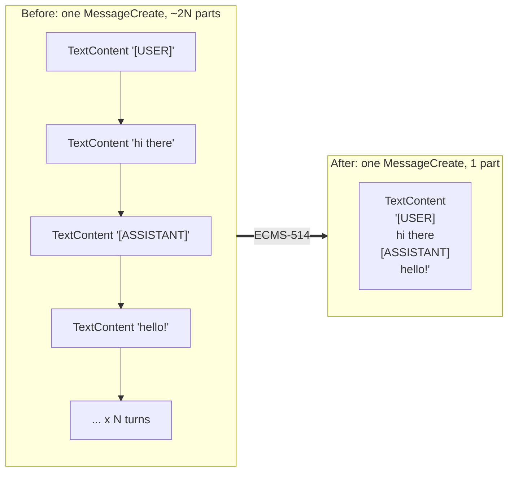

# Design: Send LXS transcript payload as a single content block

> Phase 2 of 3 (requirements → design → tasks). Derives from the approved requirements.
> This document has TWO audiences, split by the divider below: the **Design outline**
> is for human review; the **Full specification** is machine-facing detail for the
> implementor. A reviewer who reads only the outline has done their job.

## Design outline

<!-- AUTHORING RULES for the outline (keep this comment):
- This is the section a senior dev reads to approve the design and align the team.
  It is NOT the implementation spec, but it's not a teaser either: for a large change
  it may carry real detail (schema tables, API shapes, scenario→mechanism matrices)
  as long as every piece is presented narratively and earns its place. Length scales
  with the change. Exemplar: the memory-sources proposal —
  https://docs.google.com/document/d/1Gb7aZTHksoj2ZzS3AYSNIITi86JuuEs_DbsedM18bPg
- Teach before proposing: establish how the system works TODAY so the reviewer can
  check the reasoning instead of trusting it.
- Every significant decision gets its reasoning and the alternative(s) considered.
  Call out deliberate trade-offs, known limitations, and deferred work inline, each
  with its "because".
- Summary tables beat prose walls; one mermaid diagram is worth a lot (workspace
  rule: diagrams are mermaid).
-->

### Overview

On the save path, `flatten_messages_for_agent` (`mirix/utils.py:1909`) packs a
multi-turn transcript into one `MessageCreate` whose content is ~2N tiny
`TextContent` parts (a `[USER]`/`[ASSISTANT]` marker part plus a content part per
turn). Each part becomes its own content block in the LXS request, and GenOS SRF
scans **per block** — ECMS requests were observed fanning out to ~2000 tiny blocks,
overloading SRF's detectors (detectors are currently disabled for our expid; hence
P1). This design changes the packing so all consecutive text is joined into a single
`TextContent` with `"\n"`, restoring the exact single-block text the model saw before
the ECMS-73 consumer-side-flattening refactor introduced the fanout. One function
changes; one existing test assertion changes; a new unit-test module pins the
behavior.

### How the current system works

The worker (`mirix/queue/worker.py:357`) converts each wire turn to a dict (content
is **always a plain string** there — `_convert_proto_source_message_to_dict` reads
only `proto_msg.text_content`) and calls `flatten_messages_for_agent`. That function
appends, per turn, `{"type": "text", "text": "[USER]"|"[ASSISTANT]"}` and then a
second text dict for the turn's content (or extends with the list items when content
is a list). `convert_message_to_mirix_message` (`mirix/utils.py:1900`) then maps each
dict 1:1 to a `TextContent` part on a single `MessageCreate`.

The part-per-line shape survives all the way to the provider request:
`Message.to_openai_dict` (`mirix/schemas/message.py:660`) emits a **plain string**
`content` when there is exactly one `TextContent`, but a **list of
`{"type": "text"}` blocks** when there are multiple parts. So the number of
`TextContent` parts on the packed message directly equals the number of content
blocks SRF scans.

Crucially, this multi-block shape is a *regression artifact*, not the historical
behavior. Before ECMS-73 moved flattening to the consumer, the packed transcript
crossed the queue as proto `input_messages` whose `text_content` is a single string
— and the queue's producer-side reduction joins text parts with `"\n"`
(`mirix/queue/queue_util.py:44`: `proto_msg.text_content = "\n".join(text_parts)`,
whose docstring notes it matches the old queue boundary's behavior). The legacy
consumer path (`worker.py:359` → `_convert_proto_message_to_pydantic`) turns that
one string into one `TextContent`. The in-repo legacy fixture shows the exact wire
text: `"[USER]\nhi there"` (`tests/test_queue_consumer_normalization.py:329`). So
pre-ECMS-73, the model saw one `"\n"`-joined block.

### Proposed changes

**One decision drives everything: join consecutive text with `"\n"`, inside
`flatten_messages_for_agent`, before conversion.**

| Decision | Choice | Why | Alternative rejected |
|---|---|---|---|
| Separator | `"\n"` | Restores the exact pre-ECMS-73 model-visible text (`queue_util.py:44` join; legacy fixture `"[USER]\nhi there"`). Also matches what LangFuse traces already display — `llm_client_base.py:107` joins text parts with `"\n"` for the trace input — so existing traces look byte-identical after the change (observability-parity NFR). | `" "` or `""` — no evidence anywhere in the pipeline; would change the text the model sees. |
| Where to coalesce | Inside `flatten_messages_for_agent`, building a joined text dict before calling `convert_message_to_mirix_message` | Fixes every consumer of the packed message at the single source; zero blast radius outside the one function. | (a) Coalesce inside `convert_message_to_mirix_message` — it is a general-purpose helper with other callers (e.g. `extract_topics_and_temporal_info`, `rest_api.py:452`), so changing it widens blast radius. (b) Coalesce per LLM-client serializer (`to_openai_dict` et al.) — N copies of the logic, fixes only some consumers. |
| Mixed content | Buffer text, flush a single joined `TextContent` whenever a non-text item appears, pass the non-text item through unchanged | Satisfies R2.1 with the minimal number of text blocks; non-text items keep their exact today's conversion path. | Dropping or stringifying non-text items — violates R2.1. |

Before/after content-part shape:



A useful bonus: with exactly one `TextContent`, `to_openai_dict` takes its
single-part branch and emits `content` as a plain string — the request shape
collapses from a 2000-element block array to one string field.

Known limitation, called out deliberately: on today's save path the list-content
branch (and therefore the mixed-content algorithm) is **unreachable** — the wire
reduces list content to a `"\n"`-joined string at produce time (`queue_util.py:43-44`)
and `_convert_proto_source_message_to_dict` only ever yields string content. R2.1 is
still implemented because `flatten_messages_for_agent`'s contract accepts list
content (it reproduced the old `rest_api.py` flattening, which handled lists), and
we don't want a future producer of list content to silently regress the fanout fix
or lose parts.

### What is not changing

- The `[USER]`/`[ASSISTANT]` marker convention and the "non-`user` role →
  `[ASSISTANT]`" ternary — packaging fix only (requirements out-of-scope).
- The legacy `input_messages` fallback (`worker.py:359`) — already single-block;
  field being retired.
- `convert_message_to_mirix_message` — untouched; it still maps dicts 1:1 to parts.
  Its other caller, `extract_topics_and_temporal_info` (`rest_api.py:452`, used on
  the retrieval/topic-extraction path at `rest_api.py:2657`), keeps producing a few
  small parts per request — not the SRF hotspot, out of scope here.
- Provider serializers (`to_openai_dict`, `to_google_ai_dict`, ...) and the LangFuse
  trace builder — no changes; they simply receive one part instead of many.
- Anything in `context-and-memory-service` — the flattening lives entirely in MIRIX.

### Risks & what to push on

- **Text drift risk**: if any pre-ECMS-73 join was *not* `"\n"`, the model-visible
  text changes subtly. Evidence says otherwise (three independent `"\n"` sites:
  `queue_util.py:44`, legacy fixture line 329, LangFuse join at
  `llm_client_base.py:107`), but this is the claim most worth checking.
- **Empty-content turns**: a turn with `content: ""` now contributes
  `"[USER]\n"` (marker + empty line) inside the block — identical to the
  pre-ECMS-73 `"\n".join(["[USER]", ""])`, but reviewers should confirm they're
  comfortable with consecutive newlines for empty turns.
- **Malformed text items**: a list item `{"type": "text"}` with no `"text"` key
  previously raised a pydantic `ValidationError` at conversion; the new buffering
  treats it as `""` (mirroring `queue_util.py:43`). Unreachable on the save path
  today; flagged so nobody is surprised by the parity delta.

---

## Full specification

> Machine-facing, Kiro-style. The implementor (usually the agent) works from this;
> human review of everything below is OPTIONAL and at the implementor's discretion.

### Architecture

No architectural change. Save-path data flow stays:
`worker._process_message_async` (`mirix/queue/worker.py:357`) →
`flatten_messages_for_agent` (`mirix/utils.py:1909`) →
`convert_message_to_mirix_message` (`mirix/utils.py:1741`) → single `MessageCreate`
→ `server.send_messages` → agent step → provider client (`to_openai_dict` /
`to_google_ai_dict`) → LXS. Only the internal packing of the first arrow changes.

### Components & interfaces

**`flatten_messages_for_agent(messages: List[dict]) -> List[MessageCreate]`**
(`mirix/utils.py:1909`) — signature, caller, and return contract unchanged
(`[]` for empty input; otherwise exactly one `MessageCreate` with role `user`).
Replace the per-turn append body with buffer-and-flush coalescing:

```python
def flatten_messages_for_agent(messages: List[dict]) -> List[MessageCreate]:
    if not messages:
        return []

    parts: List[dict] = []
    text_buffer: List[str] = []

    def _flush() -> None:
        if text_buffer:
            parts.append({"type": "text", "text": "\n".join(text_buffer)})
            text_buffer.clear()

    for msg in messages:
        text_buffer.append("[USER]" if msg.get("role") == "user" else "[ASSISTANT]")

        content = msg.get("content", "")
        if isinstance(content, str):
            text_buffer.append(content)
        elif isinstance(content, list):
            for item in content:
                if isinstance(item, dict) and item.get("type") == "text":
                    text_buffer.append(item.get("text", ""))
                else:
                    _flush()
                    parts.append(item)
        else:
            raise ValueError(f"Invalid content type: {type(content)}")

    _flush()
    return convert_message_to_mirix_message(parts)
```

Exact semantics (normative):

1. **Marker first** — every turn contributes its marker line to the buffer before
   its content; the role ternary `"[USER]" if msg.get("role") == "user" else
   "[ASSISTANT]"` is byte-identical to today (R1.2).
2. **String content** — appended to the buffer as one line (R1.1).
3. **List content** — each item with `isinstance(item, dict) and
   item.get("type") == "text"` contributes `item.get("text", "")` to the buffer;
   any other item (non-text dict such as `image_url`/`image_data`/`file_uri`/... ,
   or a non-dict) triggers `_flush()` and is appended to `parts` unchanged, to be
   converted (or rejected) downstream by `convert_message_to_mirix_message` exactly
   as today (R2.1). Error sites for invalid items are unchanged: a non-dict or
   unknown-type dict still fails inside `convert_message_to_mirix_message`.
4. **Invalid content type** — non-str/non-list content raises the same
   `ValueError(f"Invalid content type: {type(content)}")` as today.
5. **Final flush** — after the loop, trailing buffered text becomes the last (or
   only) text dict. All-text input therefore yields `parts` of length 1 → one
   `TextContent` → `MessageCreate.content == [TextContent(...)]` (R1.1, R2.2).
6. **Separator** — `"\n"` between every buffered line, including after markers and
   around empty-string content (an empty turn yields consecutive `\n`s, matching
   the pre-ECMS-73 `"\n".join` behavior at `mirix/queue/queue_util.py:44`).

Also update the function docstring: the "matching the exact behavior of the old
pre-queue flattening" paragraph must now say the text is `"\n"`-joined into the
minimal number of text blocks (single block for all-text input) so per-block
downstream scanners see one block, while the model-visible text is unchanged from
the old packed wire format. Do not reference the Jira ticket in code or docstrings
(workspace rule); commit messages carry the ticket id.

No other production code changes. `convert_message_to_mirix_message`,
`worker.py`, schemas, and provider clients are untouched.

### Data models

None. `MessageCreate` / `TextContent` (`mirix/schemas/mirix_message_content.py:28`)
schemas unchanged; only the count of `TextContent` parts per packed message changes
(~2N → 1 for all-text transcripts). No persistence impact: provenance
`source_messages` are derived from the same per-turn dicts *independently* of this
packing (`worker.py:356`), and the packed message itself is transient agent input.

### Error handling

- Invalid turn `content` type (not str/list): unchanged `ValueError` from
  `flatten_messages_for_agent` — classified/dead-lettered by the existing queue
  error policy exactly as today.
- Invalid list items (non-dict, unknown `type`): unchanged failure inside
  `convert_message_to_mirix_message` (`TypeError`/`ValueError`), same call site.
- Parity delta (accepted, documented in outline): `{"type": "text"}` with a missing
  `"text"` key becomes `""` instead of raising pydantic `ValidationError`.
  Unreachable from the worker today (content is always a string off the wire).
- Observability: no logging/span changes. LangFuse generation input already joins
  text parts with `"\n"` (`mirix/llm_api/llm_client_base.py:107`), so traces render
  byte-identically before and after — satisfying the observability-parity NFR.

### Testing strategy

Workspace convention makes FSTs the default test layer for the ECMS service repo,
but this change is a **pure function in MIRIX** with no I/O, DB, or service
surface — the MIRIX repo's own pytest unit suite is the right layer here, and it
verifies the fix in milliseconds. (The end-to-end effect — fewer SRF blocks — is
confirmed post-deploy via the SRF team / LangFuse traces, not by a repo test.)

**New module `tests/test_flatten_messages_for_agent.py`** (pure pytest, no
fixtures/DB):

| Test case | AC | Asserts |
|---|---|---|
| `test_all_string_turns_produce_single_text_block` | R1.1 | 2-turn user/assistant input → 1 `MessageCreate`, `len(content) == 1`, `isinstance(content[0], TextContent)`, text == `"[USER]\nhi there\n[ASSISTANT]\nhello!"` |
| `test_markers_ordering_and_role_ternary_preserved` | R1.2 | user/system/assistant turns → single block whose lines are `[USER]`, `[ASSISTANT]` (system), `[ASSISTANT]` in input order, each followed by its content line |
| `test_list_content_all_text_coalesces_into_single_block` | R2.2 | turn with `content=[{"type":"text",...}, {"type":"text",...}]` → exactly 1 `TextContent`, items joined with `"\n"` after the marker |
| `test_non_text_item_survives_with_text_coalesced_around_it` | R2.1 | `[text, image(database_image_id), text]` list content → exactly 3 parts: `TextContent` (marker + leading text), `ImageContent`, `TextContent` (trailing text); no text lost, order preserved |
| `test_trailing_non_text_item_flushes_prior_text_only` | R2.1 | list ending in a non-text item → final part is the non-text part; preceding text is one block |
| `test_empty_messages_returns_empty_list` | contract | `flatten_messages_for_agent([]) == []` |
| `test_empty_string_content_keeps_marker_line` | R1.2 | turn with `content=""` → block contains `"[USER]\n"` segment (consecutive newlines), matching legacy join |
| `test_invalid_content_type_raises_value_error` | contract | `content=42` → `ValueError` |

(Use `{"type": "database_image_id", "image_id": ...}` for the non-text item — it
converts without file-manager/org_id side effects, per `mirix/utils.py:1878`.)

**Updated existing test** — the only test in the repo asserting the multi-part
shape (blast-radius sweep: no other test file references
`flatten_messages_for_agent`, `convert_message_to_mirix_message`, or the packed
marker parts):

- `tests/test_queue_consumer_normalization.py::test_worker_unified_messages_field_flattens_and_persists_per_turn`
  (lines 198–202): replace
  `texts == ["[USER]", "hi there", "[ASSISTANT]", "hello!"]` with a single-part
  assertion: `len(input_messages[0].content) == 1` and
  `input_messages[0].content[0].text == "[USER]\nhi there\n[ASSISTANT]\nhello!"`.
  The provenance assertions in the same test (lines 205–209) are untouched.
- `tests/test_queue_consumer_normalization.py::test_worker_legacy_dual_array_fallback_still_works`
  needs **no change** — the legacy path bypasses `flatten_messages_for_agent`.

Run: `pytest tests/test_flatten_messages_for_agent.py tests/test_queue_consumer_normalization.py -v`
(no server/DB needed for the new module; the normalization tests already run
mock-only). Acceptance evidence = these tests green plus the unchanged-suite run
per repo convention (`./scripts/run_tests_with_docker.sh` or
`pytest -m "not integration"`).

### Trade-offs & decisions log

| # | Decision | Rationale | Alternatives |
|---|---|---|---|
| 1 | Join separator `"\n"` | Three independent in-repo evidence sites: pre-ECMS-73 wire join `mirix/queue/queue_util.py:44`; legacy packed fixture `tests/test_queue_consumer_normalization.py:329` (`"[USER]\nhi there"`); LangFuse trace join `mirix/llm_api/llm_client_base.py:107`. Restores historical model-visible text and keeps traces identical. | space / empty-string joins (no supporting evidence; alters prompt text) |
| 2 | Coalesce at the source, inside `flatten_messages_for_agent` | Single fix point for all consumers of the packed message; the general-purpose converter and provider serializers keep their contracts. | coalesce in `convert_message_to_mirix_message` (other callers affected); coalesce per provider serializer (duplicated, partial) |
| 3 | Buffer-and-flush for mixed content | Minimal text blocks around pass-through non-text items (R2.1) with today's downstream conversion untouched. | flatten-only-when-all-text (would silently keep fanout for future list producers) |
| 4 | No `docs/decisions/` entry | 1-point packaging fix local to one function; nothing durable beyond this spec (minimalism mode, full intensity). | decision-NNN.md (disproportionate) |

### Open questions

None — separator and fix location are evidence-settled above; requirements carried
no open questions.
