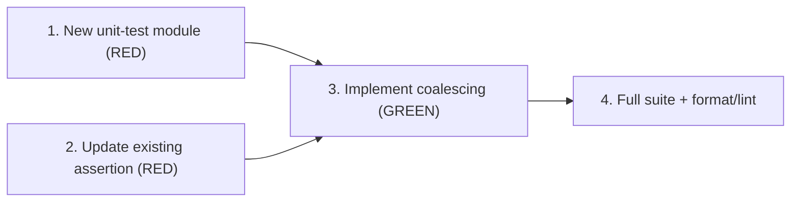

# Tasks: Send LXS transcript payload as a single content block

> Phase 3 of 3 (requirements → design → tasks). A DAG of implementation tasks derived
> from the approved design. Machine-facing: human review is OPTIONAL by default (per
> the story's review plan — see the Phase Gates rule in the workspace CLAUDE.md); most
> reviewers approve requirements + design outline and next look at the code on the PR.
> Once this phase completes, the-loop executes these end-to-end with minimal/no
> intervention.

## Task list

Each task is a checkbox, references the requirement(s) it satisfies, and declares its
dependencies so the-loop can build the execution DAG. Keep tasks small and verifiable.
TDD mode is standard: tasks 1–2 land the failing tests; task 3 makes them pass.
All tasks are tier-5 (single pure function, one caller, no interface/data change).

- [ ] 1. Write the new unit-test module `tests/test_flatten_messages_for_agent.py` (RED)
  - Pure pytest, no fixtures/DB/server. Implement exactly the 8 named test cases from
    the design's Testing strategy table (design.md §Testing strategy), asserting the
    single-`TextContent` shape, `"\n"`-joined text (e.g.
    `"[USER]\nhi there\n[ASSISTANT]\nhello!"`), marker/role-ternary preservation,
    list-content coalescing, non-text pass-through with buffer-flush ordering
    (use `{"type": "database_image_id", "image_id": ...}` as the non-text item),
    empty-input `[]` contract, empty-string content, and the `ValueError` contract.
  - Do NOT touch `mirix/utils.py` in this task.
  - _Verification:_ `pytest tests/test_flatten_messages_for_agent.py -v` — the 6
    coalescing-behavior tests FAIL against the current multi-part implementation;
    the two unchanged-contract tests (`test_empty_messages_returns_empty_list`,
    `test_invalid_content_type_raises_value_error`) PASS.
  - _Depends on:_ none
  - _Requirements:_ R1.1, R1.2, R2.1, R2.2

- [ ] 2. Update the existing multi-part assertion to the single-block shape (RED)
  - In `tests/test_queue_consumer_normalization.py::test_worker_unified_messages_field_flattens_and_persists_per_turn`
    (lines ~198–202): replace `texts == ["[USER]", "hi there", "[ASSISTANT]", "hello!"]`
    with `len(input_messages[0].content) == 1` and
    `input_messages[0].content[0].text == "[USER]\nhi there\n[ASSISTANT]\nhello!"`.
    Leave the provenance assertions (lines ~205–209) and
    `test_worker_legacy_dual_array_fallback_still_works` untouched (legacy path
    bypasses `flatten_messages_for_agent`).
  - _Verification:_ `pytest tests/test_queue_consumer_normalization.py -v` — the
    updated test FAILS against the current implementation; every other test in the
    module still PASSES.
  - _Depends on:_ none
  - _Requirements:_ R1.1, R1.2

- [ ] 3. Implement buffer-and-flush coalescing in `flatten_messages_for_agent` (GREEN)
  - Replace the per-turn append body of `flatten_messages_for_agent`
    (`mirix/utils.py:1909`) with the buffer-and-flush algorithm given verbatim in
    design.md §Components & interfaces: buffer marker + text lines, `"\n"`-join on
    flush, flush before appending a non-text list item unchanged, final flush after
    the loop; preserve the empty-input `[]` return, the role ternary, and the
    `ValueError(f"Invalid content type: {type(content)}")` for non-str/non-list
    content. Update the docstring per the design (text is `"\n"`-joined into the
    minimal number of text blocks; no Jira id in code/docstrings). No other
    production files change — `convert_message_to_mirix_message`, `worker.py`,
    schemas, and provider clients are untouched.
  - _Verification:_ `pytest tests/test_flatten_messages_for_agent.py tests/test_queue_consumer_normalization.py -v`
    — all tests PASS (no server/DB needed).
  - _Depends on:_ 1, 2
  - _Requirements:_ R1.1, R1.2, R2.1, R2.2

- [ ] 4. Full non-integration suite + format/lint
  - Confirm no other test in the repo depended on the multi-part shape (design's
    blast-radius sweep predicts none) and the change is style-clean.
  - _Verification:_ `pytest -m "not integration" -v` green (or
    `./scripts/run_tests_with_docker.sh --podman -s -v -m "not integration"` per repo
    convention), then `poetry run black . && poetry run isort .` produces no diff
    outside the three files touched by tasks 1–3.
  - _Depends on:_ 3
  - _Requirements:_ R1, R2 (acceptance evidence)

## Dependency graph (DAG)

Tasks 1 and 2 are independent and parallelizable; 3 waits on both; 4 is the final gate.

## Checkpoints

- **After task 2** (both RED tasks done): run
  `pytest tests/test_flatten_messages_for_agent.py tests/test_queue_consumer_normalization.py -v`
  and record the expected-failure snapshot in the execution log.
- **After task 3**: same command, all green — this is the per-AC evidence point
  (R1.1, R1.2, R2.1, R2.2 each pinned by a named test).
- **After task 4**: full non-integration suite green + clean format/lint; update the
  execution log and hand off to review.
